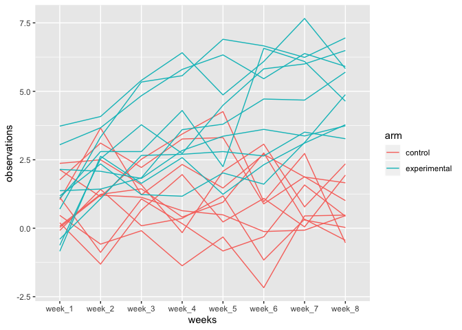
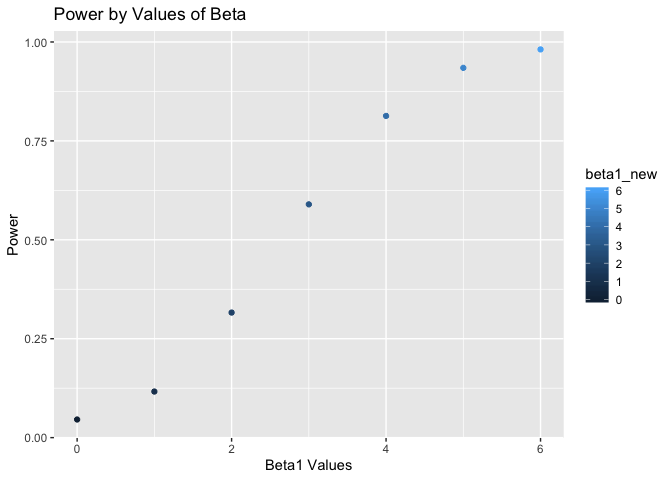
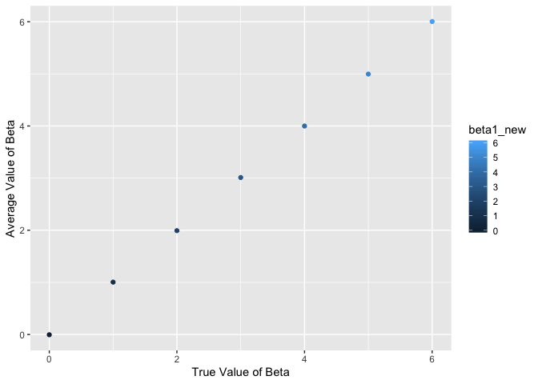
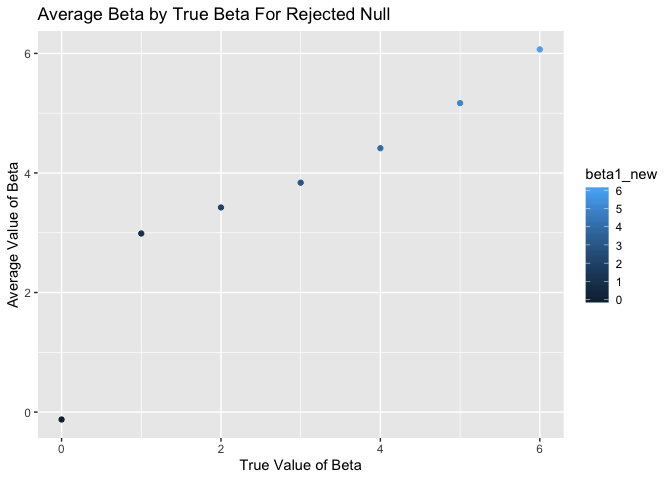

HW 5
================
Sarah Munro
11/5/2019

# Problem 1

*Create a function that replaces missing numeric values with the column
mean, and replace missing character variables with “virginica”, then map
it over the dataset*

``` r
replace_x = function(x) {
  if (is.numeric(x) == T) {
  x[is.na(x)] = (mean(x, na.rm = T))}
  else {
   x[is.na(x)] = "virginica" }
  x
}
iris_with_missing = map_df(iris_with_missing, replace_x)
```

# Problem 2

*Import the zip file and create a dataframe with all the csv files*

``` r
library(readr)
library(purrr)

files <- list.files(path="./Data/unzipped", pattern =".*csv")

hw5_df <- map_df(paste("./Data/unzipped", files, sep = "/"), 
                 read_csv ) %>% 
  mutate(
    participants = files ,
    participants = str_remove(participants, ".csv")) %>%
  separate(participants, into = c("arm", "subject_id"), sep = "_") %>%
  mutate(
    arm = str_replace(arm, "con", "control"),
    arm = str_replace(arm, "exp", "experimental"),
    subject_id = c(1:20)
  ) %>%
  select(arm, subject_id, everything())
```

*Make a spaghetti plot showing the subject’s observations over time by
arm*

``` r
hw5_df %>%
  pivot_longer(
    week_1:week_8,
    names_to = "weeks",
    values_to = "observations"
  ) %>%

ggplot(aes(x = weeks, y = observations, group = subject_id, color = arm)) + geom_line()
```

<!-- -->

# Problem 3

*Create a simulation with preset parameters and values*

``` r
set.seed(1)

sim_regression = function(n = 30, beta0 = 2, beta1 = 0) {
  
  sim_data = tibble(
    x = rnorm(n, mean = 0, sd = 1),
    y = beta0 + beta1 * x + rnorm(n, 0, sqrt(50))
  )
  
  ls_fit = lm(y ~ x, data = sim_data) %>%
  broom::tidy()
  
 tibble(
    beta1_hat = ls_fit[[2, 2]],
    p_value = ls_fit[[2, 5]]
  )
}

sim_results = 
  rerun(10000, sim_regression()) %>% 
  bind_rows()
```

*Run the simulation 10000 times for different values of beta*

``` r
sim_results = 
  tibble(beta1_new = c(0, 1, 2, 3, 4, 5, 6)) %>% 
  mutate(
    output_lists = map(.x = beta1_new, ~rerun(10000, sim_regression(beta1 = .x))),
    estimate_dfs = map(output_lists, bind_rows)) %>% 
  select(-output_lists) %>% 
  unnest(estimate_dfs)
```

*Plot the proportion of times the null was rejected for each beta*

``` r
sim_results %>%
  mutate(
    sim_power = if_else(p_value <= 0.05, "rejected", "not rejected")
  ) %>%
  select(beta1_new, sim_power) %>%
  group_by(beta1_new) %>%
  summarize(
    total = n(),
    proportion = sum(sim_power == "rejected")/total 
  ) %>%
  ggplot(aes(x = beta1_new, y = proportion)) + geom_point(aes(color = beta1_new)) + labs( title = "Power by Values of Beta", x = "Beta1 Values", y = "Power" )
```

<!-- -->

*Plot the average beta estimates by true values of beta*

``` r
sim_results %>%
  group_by(beta1_new) %>%
  summarize(avg_beta = mean(beta1_hat)) %>%
  ggplot(aes(x = beta1_new, y = avg_beta)) + geom_point(aes(color = beta1_new)) + labs(x = "True Value of Beta", y = "Average Value of Beta")
```

<!-- -->

*Plot the average value of beta by the true values when the null is
rejected*

``` r
sim_results %>%
  mutate(
    sim_power = if_else(p_value <= 0.05, "rejected", "not rejected")
  ) %>%
  filter( sim_power == "rejected") %>%
  group_by(beta1_new) %>%
  summarize(avg_beta = mean(beta1_hat)) %>%
  ggplot(aes(x = beta1_new, y = avg_beta)) + geom_point(aes(color = beta1_new)) + labs(title = "Average Beta by True Beta For Rejected Null", x = "True Value of Beta", y = "Average Value of Beta")
```

<!-- --> The plots are
different when you filter the data to include only times when the null
is rejected. The first plot is perfectly linear, but for the second plot
you see higher values of beta average when the effect size is greater
than zero. This may be because it is more likely to reject the null with
a higher effect size.
